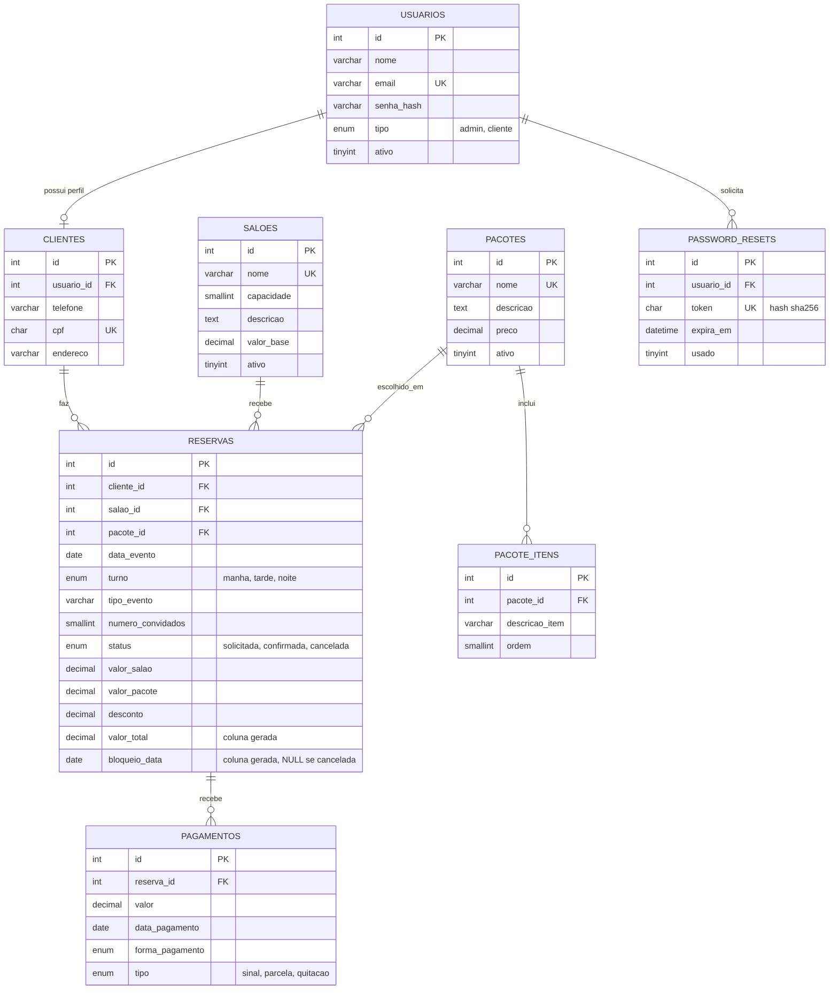

# Carlore's — Sistema de Gestão de Casa de Festas

Sistema web completo (PHP puro + MySQL) para gestão de uma casa de festas fictícia que administra
múltiplos salões para locação de eventos. Desenvolvido como Trabalho T2 da disciplina de Desenvolvimento Web.

Painel **Administrador** (gestão completa: salões, pacotes, clientes, reservas, pagamentos e relatórios)
e portal do **Cliente** (cadastro, solicitação de reservas, acompanhamento de pagamentos).

## Funcionalidades

- Autenticação com sessões (login, logout, cadastro de cliente, recuperação de senha simulada).
- CRUD completo de Salões, Pacotes (com itens inclusos), Clientes, Reservas e Pagamentos.
- Controle de disponibilidade de salão por data (a nível de banco e de aplicação).
- Controle financeiro por reserva (valor total, pagamentos parciais, saldo devedor calculado).
- Dois relatórios com filtros e exportação (CSV e impressão/PDF via navegador):
  faturamento por período e agenda de ocupação dos salões.
- Segurança: prepared statements (PDO), `password_hash`, escape de saída (XSS), CSRF token,
  validação client-side (JS/HTML5) e server-side (PHP).

## Requisitos

- PHP 8.1 ou superior (usa `match`, `str_contains`, tipos union).
- MySQL 5.7.6+ ou MariaDB 10.2+ (suporte a colunas `GENERATED ALWAYS AS`).
- XAMPP (recomendado) — inclui Apache, PHP, MySQL e phpMyAdmin.

## Instalação

### 1. Instalar o XAMPP

Baixe e instale o [XAMPP](https://www.apachefriends.org/) (inclui PHP e MySQL). Após instalar, abra o
**XAMPP Control Panel** e inicie os serviços **Apache** e **MySQL**.

### 2. Criar o banco de dados

Abra o phpMyAdmin (`http://localhost/phpmyadmin`) e importe, nesta ordem:

1. `database/schema.sql` — cria o banco `carlores` e todas as tabelas.
2. `database/seed.sql` — popula com dados de exemplo (salões, pacotes, clientes e reservas fictícias).

Ou, via terminal (com o MySQL do XAMPP no PATH):

```bash
mysql -u root -p < database/schema.sql
mysql -u root -p < database/seed.sql
```

### 3. Configurar a conexão com o banco

Por padrão, `config/database.php` usa usuário `root` sem senha (padrão do XAMPP). Se o seu MySQL usa
outras credenciais, edite as constantes `USUARIO`/`SENHA` em `config/database.php`.

### 4. Rodar o projeto

**Opção recomendada** — servidor embutido do PHP, apontando para a pasta `public/` (evita configurar
Virtual Host e problemas de caminho com o OneDrive):

```bash
php -S localhost:8000 -t public
```

Acesse **http://localhost:8000**.

**Alternativa** — copiar (ou linkar) esta pasta para dentro de `C:\xampp\htdocs\carlores` e configurar
o Apache para apontar o `DocumentRoot` para a subpasta `public/` desse diretório (via Virtual Host).

> Importante: o *document root* do servidor deve ser sempre a pasta `public/`, nunca a raiz do projeto —
> é isso que mantém `config/`, `models/`, `services/`, `views/` e `database/` fora do alcance do navegador.

## Contas de teste (seed)

Senha de todas as contas abaixo: **`123456`**

| Perfil | E-mail | Senha |
|---|---|---|
| Administrador | `admin@carlores.com.br` | `123456` |
| Cliente | `fernanda.albuquerque@email.com` | `123456` |
| Cliente | `marcos.tavares@email.com` | `123456` |
| Cliente | `juliana.menezes@email.com` | `123456` |
| Cliente | `ricardo.lima@email.com` | `123456` |

## Estrutura do projeto

```
dev/
├── config/       # bootstrap, configuração e conexão PDO
├── models/       # acesso a dados (1 classe por tabela, só PDO::prepare)
├── services/     # regras de negócio (auth, reservas, pagamentos, relatórios, upload)
├── helpers/      # funções utilitárias (auth, csrf, validação, flash, formatação)
├── views/        # apresentação (fora do document root, nunca acessível via URL)
├── database/     # schema.sql e seed.sql
└── public/       # document root do Apache — único diretório exposto ao navegador
```

Cada página em `public/` segue o mesmo padrão: inclui o `bootstrap.php`, chama `exigirAdmin()` /
`exigirCliente()` quando a página é protegida, processa o `POST` (validação → Service → Model) e
inclui a view correspondente em `views/`.

## Diagrama Entidade-Relacionamento



A restrição `UNIQUE(salao_id, bloqueio_data)` em `RESERVAS` é o que garante, a nível de banco, que um
salão nunca tenha duas reservas ativas na mesma data (`bloqueio_data` é `NULL` quando a reserva está
cancelada, liberando a data automaticamente). Mais detalhes em [RELATORIO.md](RELATORIO.md).

## Segurança implementada

| Requisito | Onde |
|---|---|
| SQL Injection | Todas as queries usam `PDO::prepare()` com parâmetros nomeados (`models/*.php`), com `PDO::ATTR_EMULATE_PREPARES=false`. |
| Hash de senha | `password_hash()`/`password_verify()` (`services/AuthService.php`) — nunca senha em texto plano. |
| XSS | Helper `e()` (`htmlspecialchars`) usado em toda saída dinâmica nas views. |
| CSRF | Token por sessão validado em todo POST (`helpers/csrf_helper.php`). |
| Validação | Client-side (HTML5 + `assets/js/validacao.js`) e server-side (`helpers/validation_helper.php`), sempre antes de qualquer escrita no banco. |

## Licença

Projeto acadêmico, sem licença específica de uso comercial.
